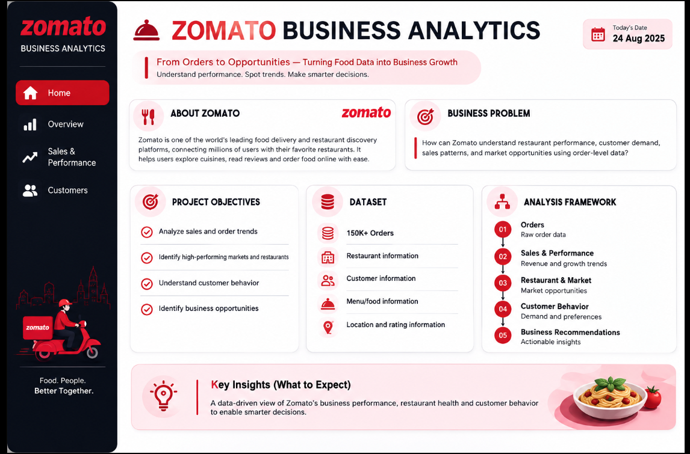
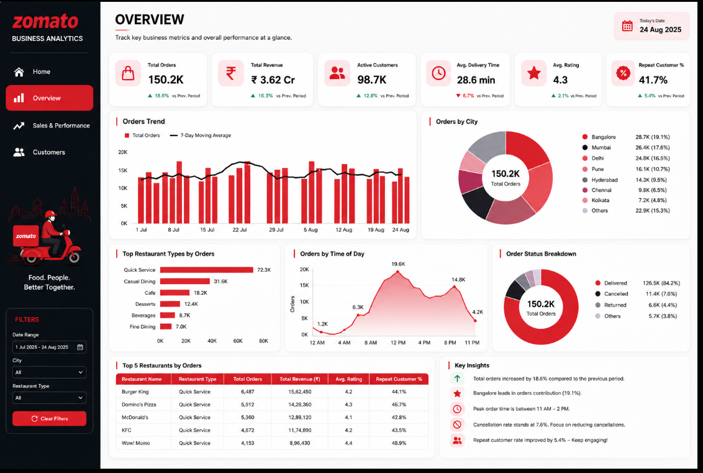
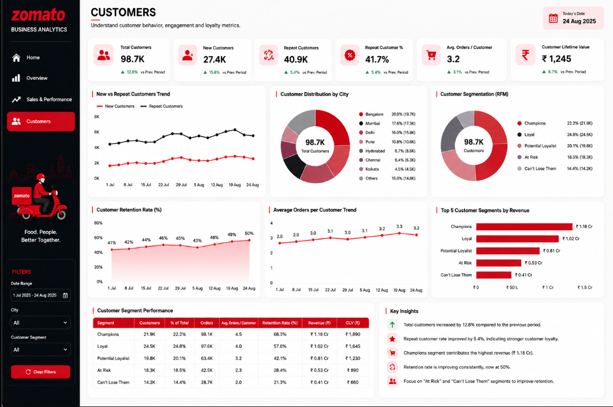
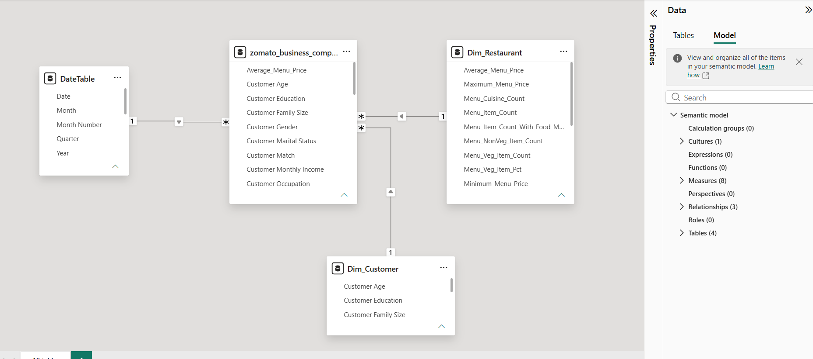

# Zomato Business Analytics — Power BI Dashboard

## About the Business

Zomato is a food delivery and restaurant discovery platform that connects customers with restaurants and enables users to discover, order, and review food.

With a large volume of orders, customer information, restaurant data, locations, and transactions, analytics can help the business understand performance, customer behavior, sales trends, and growth opportunities.

This Power BI project transforms raw Zomato data into an interactive business analytics solution focused on **business performance, sales & revenue, customer analytics, and data modelling**.

---

## Business Problem

Zomato has access to a large amount of business data, but raw data alone does not provide a clear picture of overall performance.

The key business question is:

> **How can Zomato use its data to understand business performance, sales patterns, customer behavior, and identify opportunities for growth?**

The dashboard is designed to answer this through four major areas:

- Overall Business Performance
- Sales & Performance
- Customer Analytics
- Data Modelling

---

# Dashboard Analysis

| Business Problem | Dashboard Description | Dashboard | Key Insight |
|---|---|---|---|
| **Business Context & Objectives**     The business needs a clear analytical direction before reviewing detailed metrics. | **Home** introduces Zomato, the business problem, project objectives, dataset, and analysis framework. |  | The analysis follows the flow **Orders → Sales & Performance → Customer Behavior → Business Recommendations**. |
| **Overall Business Performance**     Management needs a quick view of business health and key performance indicators. | **Overview** tracks total orders, revenue, customers, delivery time, ratings, cities, restaurant types, order timing, and order status. |  | **150.2K orders** generated **₹3.62 Cr revenue**, with **98.7K active customers** and a **41.7% repeat customer rate**. |
| **Sales & Revenue Performance**     The business needs to understand what is driving revenue and how sales performance is changing. | **Sales & Performance** analyzes revenue trends, AOV, discounts, commission, net revenue, restaurant types, cities, and payment methods. |  | Revenue increased by **16.3%**, while food orders contributed **82.1%** of total revenue and AOV improved by **2.7%**. |
| **Customer Growth & Retention**     The business needs to understand customer growth, loyalty, retention, and customer value. | **Customers** analyzes new vs. repeat customers, retention, customer segmentation, order frequency, revenue by segment, and CLV. |  | Customer retention reached **50%**, repeat customer rate improved by **5.4%**, and Champions generated **₹1.18 Cr**. |
| **Reliable Data Analysis**     A reliable dashboard requires a structured data model and relationships between business entities. | **Modelling** shows the Power BI semantic model and relationships between the main order data and supporting dimensions. |  | The model contains **4 tables, 3 relationships, and 8 measures**, providing the foundation for the dashboard. |

---

# Key Business Insights

## Overall Performance

- **150.2K total orders** generated **₹3.62 Cr revenue**.
- **98.7K active customers** were recorded.
- Repeat customer rate reached **41.7%**.
- Bangalore contributed the highest share of orders at **19.1%**.

## Sales & Performance

- Revenue increased by **16.3%** compared with the previous period.
- Food orders contributed **82.1%** of total revenue.
- Average Order Value improved by **2.7%** to approximately **₹241**.
- Bangalore generated the highest city-level revenue at approximately **₹72.6 L**.

## Customer Analytics

- Total customers reached **98.7K**.
- Repeat customer rate improved by **5.4%**.
- Customer retention reached **50%**.
- The **Champions** segment generated the highest revenue at approximately **₹1.18 Cr**.
- Customer Lifetime Value was approximately **₹1,245**.

---

# Data Model

The Power BI solution uses a structured semantic model containing:

| Component | Purpose |
|---|---|
| **Main Order Data** | Stores the core transactional and order-level information |
| **DateTable** | Supports date, month, quarter and year analysis |
| **Dim_Restaurant** | Supports restaurant and menu-related analysis |
| **Dim_Customer** | Supports customer-related analysis |
| **Measures** | Provides reusable calculations for dashboard KPIs |

**Model Structure:** 4 Tables · 3 Relationships · 8 Measures

---

# Tools & Skills

| Area | Skills / Tools |
|---|---|
| **Visualization** | Power BI |
| **Data Modelling** | Dimension Tables, Relationships, Semantic Model |
| **Business Analysis** | Sales, Orders, Customers, Revenue & Performance Analysis |
| **Dashboard Design** | KPI Cards, Charts, Filters, Navigation & Business Storytelling |
| **Analytics** | Trend Analysis, Segmentation, Retention & KPI Analysis |
| **Reporting** | Business Insights & Actionable Recommendations |

---

# Project Outcome

The project demonstrates the complete journey:

**Raw Business Data → Data Model → Interactive Dashboard → Business Insights**

The final Power BI solution provides stakeholders with a centralized view of **business performance, sales trends, customer behavior, and key opportunities**, helping convert complex data into clear and actionable business decisions.
